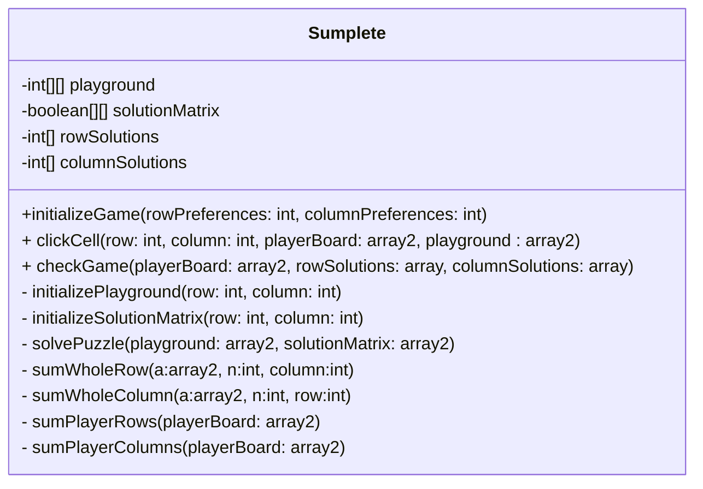
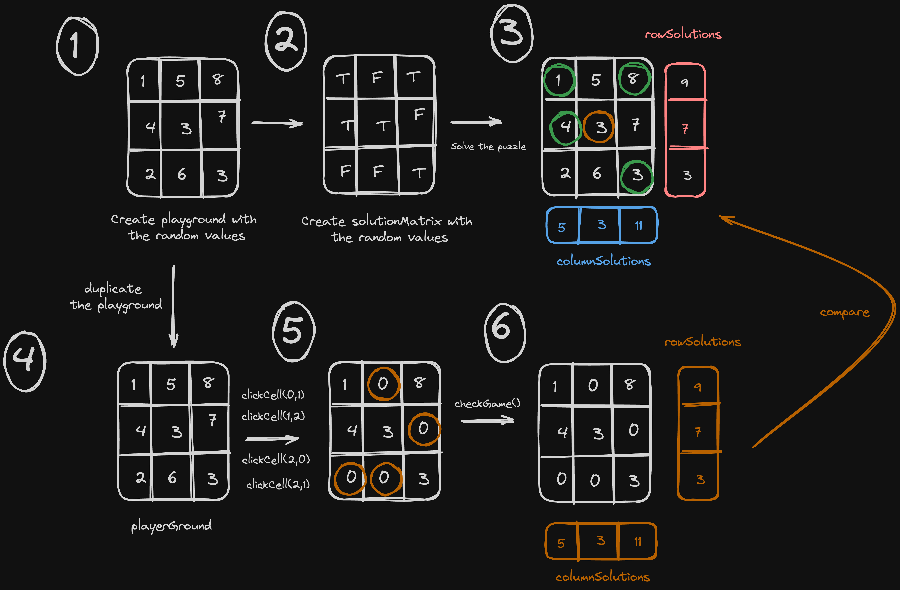

# CS603 Sumplete Game Project Report - Ata Gunay

## Program Design

The game is designed as a class:

###  Class Diagram

Note: Mermaid is a JavaScript-based diagramming and charting tool that renders Markdown-inspired text definitions to create and modify diagrams dynamically. If you can't see the class diagram you may need to install the Mermaid extension to your editor

For more information: https://mermaid.js.org/

### Steps

1. Call the constructor and create a new object from the class
2. Call the `initializeGame()`method to initialize the board with random values and find the answer key of the board
3. Call the `clickCell()` to click a specific cell and set the value of the cell (zero or old value)
4. Call the `checkGame()` to determine if the game is finished or not

### Data Structures

1. `array2<int>` : It is used to illustrate the playground and playerground. This data structure holds the random values generated by the game and player preferences

2. `array2<bool>`: It is used to determine which cells should be selected. You can find the solutionMatrix in the pragramme.

3. `array`: It is used to store the correct row and column results as an answer key. Also, row and column results according to the player's preferences

### Drawbacks

* Program can store the row and column results in the last row and column of the playground. At the moment, it uses different arrays to store the these values. Thus, it uses more memory during the execution of the programme.

### Advantages

* The programme uses different arrays to store the row and column results. This hits the separation of concerns design. Separation of concerns results in more degrees of freedom for some aspect of the program's design, deployment, or usage. These data structures may used for different puposes.

### Improvement Points

* The program compares the correct row and column results with the user's column and row results while deciding whether the game is finished. We can change the verification process according to the solution Matrix of the game and player. This matrix holds only true/false, so comparing the two boolean values will be faster than comparing the two integers. It works especially well for large playgrounds. 

### Q/A

* How you would generate multiple boards?

    When you create an object from the `Sumplete` class, you can    generate multiple games with calling `initializeGame()` method.

* How you would generate multiple boards with the different sizes?

    You can pass your row and column preferences to the `initializeGame()` method

* Does your code work for negative values on the board?

    Yes. It works for negative values as well because the programme uses integer data type instead of natural number data type. Also, calculation of the row and column result works properly with the random values.

* What assumption have you made about the board?

    1. Row and column preferences should be equal
